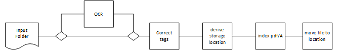

# Requirements Specification

## Document Processing Pipeline



1. Take file from Scan folder
   * take latest file from predefined folder
   * support explicit file selection

1. run OCR software
   * use temp folder to store intermediate results
   * create pdf/A

1. correct existing / add additional tags to pdf document
   * use isharp.dll /

1. derive storage location proposal
   * Unterlagen vs. Rechnungen, Reports  => storage folder
   * Herausgeber (SDK, comdirect, Siemens, ...)
   * Zusatztext (Jahresbescheinigung)
   * Jahr

1. index file
   * use tags created

1. move file to storage location

## Index Attributes

### Documents

* Title : document title
* Author : document author
* LastModified : file's last time modified
* Keywords : categorizing keywords
* Content : content for fulltext indexing
* Path : file path (relative to folder root)
* FolderID : root folder id
* ContentType : mime type coming from Tika
* DocumentType : [Buch, Artikel, Rechnung, Unterlagen, ...]

* Rating : [1..10]

#### Disabling SourceField

When disabling `SourceField` (see ManagementService => .SourceField(sf => sf.Enabled(false)))) fields need to explicitly specified to be returned when querying.

This makes building the query and accessing the returned information cumbersome:

```c#
var result = esClient.Search<DocDescriptor>(s => s
                                    .Index(cfg.DocumentSearchIndexName)
                                    .Query(q => q.QueryString(c => c.Query("SQL")))
                                    .StoredFields(fs => fs
                                        .Field(p => p.Title)
                                        .Field(p => p.Author)
                                        .Field(p => p.Path)
                                        .Field(p => p.Keywords))
);
var hit = result.Hits.First();
Assert.AreEqual("Clare Churcher", hit.Fields.ValueOf<DocDescriptor,string>(t => t.Author));
Assert.AreEqual("Clare Churcher", hit.Fields.Value<string>("author"));
```

#### Excluding content from SourceField

This was the preferred solution:

```c#
docIndex.Mappings(mp => mp.Map<DocDescriptor>(m => m.AutoMap()
                                                .SourceField(s => s.Excludes(new[] { "content" }))));
```

See:\
<https://github.com/pmario71/DesktopSearch-new/blob/master/DesktopSearch.Core/DataModel/Documents/DocDescriptor.cs>

### Folders

* FolderID
* RootPath

## Dependent Services

Use docker-compose to start all services that are required.