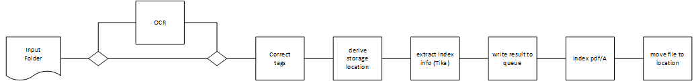

# Requirements Specification

## Document Processing Pipeline

1. Take file from Scan folder
   * take latest file from predefined folder
   * support explicit file selection

1. run OCR software
   * use temp folder to store intermediate results
   * create pdf/A

1. correct existing / add additional tags to pdf document
   * use isharp.dll /

1. derive storage location proposal
   * Unterlagen vs. Rechnungen, Reports  => storage folder
   * Herausgeber (SDK, comdirect, Siemens, ...)
   * Zusatztext (Jahresbescheinigung)
   * Jahr

1. index file
   * use tags created

1. move file to storage location

## Index Attributes

### Documents

* Title : document title
* Author : document author
* LastModified : file's last time modified
* Keywords : categorizing keywords
* Content : content for fulltext indexing
* Path : file path (relative to folder root)
* FolderID : root folder id
* ContentType : [Buch, Artikel, Rechnung, Unterlagen, ...]
* Rating : [1..10]

See:\
<https://github.com/pmario71/DesktopSearch-new/blob/master/DesktopSearch.Core/DataModel/Documents/DocDescriptor.cs>

### Folders

* FolderID
* RootPath

## Dependent Services

Use docker-compose to start all services that are required.